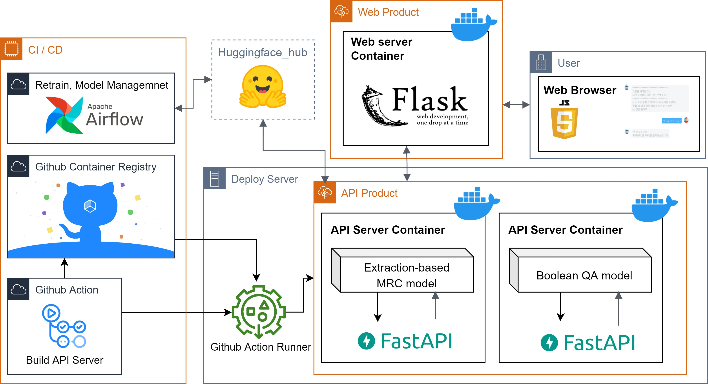

# Twenty-Questions Game

# Model Overview
# Product Overview

- API Product
  - Dockerizing two API server.
  - Provide differenet CUDA environments for two model.
- Web Product
  - Dockerizing flask web server.
  - Asynchronous connection for two API server.
- CI/CD
  - Airflow
    - Retrain Boolean QA Model.
    - Evaluate retrained model.
    - Upload model to Huggingface Hub.
  - Github Action
    - Build docker image of API product
    - Execute Github Runner to deploy new docker image.
---
# Airflow

[Airflow documnet](airflow/README.md)


# API server
[API document](api/README.md)

## API Demo
```sh
# Boolean QA Model Demo
$ ./bm-demo.sh
# Extraction-based QA Model Demo
$ ./em-demo.sh
```
## API Docker Build
```
$ sudo ./build.sh
```
# Front-end
## Front-end Demo
```sh
$ cd app
$ pip install -r requirements.txt
$ python myapp.py
```
## Front-end Docker Build
```sh
$ sudo docker-compose up -d --build app
```
# Model
## Train, Inference environments
```sh
$ pip install -r BoolQA_model/requiremnets.txt
$ pip install -r QA_model/requiremnets.txt
```
## Infrenece testing of Boolean QA model
```sh
$ python 
```
## Train Extraction-based model
```sh
$ python train.py
```
## Infrenece testing of Extraction-based model
```sh
$ python test_extraction_qa_inference.py
```