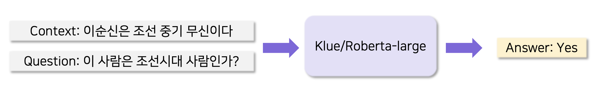

# Twenty-Questions Game

## 팀원 소개
|김다영|김다인|박성호 **(PM)**|박재형|서동건|정민지|최석민|
| :---: | :---: | :---: | :---: | :---: | :---: | :---:|
| <a href="https://github.com/keemdy" height="5" width="10" target="_blank"> | <a href="https://github.com/danny980521" height="5" width="10" target="_blank">| <a href="https://github.com/naem1023" height="5" width="10" target="_blank"> | <a href="https://github.com/Jay-Ppark" height="5" width="10" target="_blank">|  <a href="https://github.com/donggunseo" height="5" width="10" target="_blank">|<a href="https://github.com/minji-o-j" height="5" width="10" target="_blank">| <a href="https://github.com/RockMiin" height="5" width="10" target="_blank">|
|Data, Serving|Data, MLOps|Data, MLOps, Serving|Data,<br>Front-End|Data, Modeling|Data, MLOps, Serving|Data, Modeling, MLOps|

  
---
# Project Flow

---
# Model Overview

## Extraction-based MRC model

- Get Answer of Question extracted from context
- Huggingface model hub : https://huggingface.co/NaDy/ko-mrc-model


## BoolQA Model


- Get 3 Answer ( "YES" : 1, "NO" : 0, "NO ANSWER" : 2) 
- Huggingface model hub : https://huggingface.co/rockmiin

---
# Product Overview


- API Product
  - Dockerizing two API server.
  - Provide differenet CUDA environments for two model.
- Web Product
  - Dockerizing flask web server.
  - Asynchronous connection for two API server.
- CI/CD
  - Airflow
    - Retrain Boolean QA Model.
    - Evaluate retrained model.
    - Upload model to Huggingface Hub.
  - Github Action
    - Build docker image of API product
    - Execute Github Runner to deploy new docker image.
---
# Airflow

[Airflow documnet](airflow/README.md)


# API server
[API document](api/README.md)

## API Demo
```sh
# Boolean QA Model Demo
$ ./bm-demo.sh
# Extraction-based QA Model Demo
$ ./em-demo.sh
```
## API Docker Build
```
$ sudo ./build.sh
```
# Front-end
## Front-end Demo
```sh
$ cd app
$ pip install -r requirements.txt
$ python myapp.py
```
## Front-end Docker Build
```sh
$ sudo docker-compose up -d --build app
```
# Model
## Train, Inference environments
```sh
$ pip install -r BoolQA_model/requiremnets.txt
$ pip install -r QA_model/requiremnets.txt
```
## Infrenece testing of Boolean QA model
```sh
$ python 
```
## Train Extraction-based model
```sh
$ python train.py
```
## Infrenece testing of Extraction-based model
```sh
$ python test_extraction_qa_inference.py
```

# Reference

## Model

•[BoolQ](https://arxiv.org/abs/1905.10044)[: Exploring the Surprising Difficulty of Natural Yes/No Questions](https://arxiv.org/abs/1905.10044)(Clark et al., 2019)

•[klue](https://huggingface.co/klue/roberta-large)[/](https://huggingface.co/klue/roberta-large)[roberta](https://huggingface.co/klue/roberta-large)[-large](https://huggingface.co/klue/roberta-large)


## Software

Web Frameworks

- [Bootstrap](https://getbootstrap.com/)

- [jQuery](https://jquery.com/)

- [FastAPI](https://github.com/tiangolo/fastapi)

